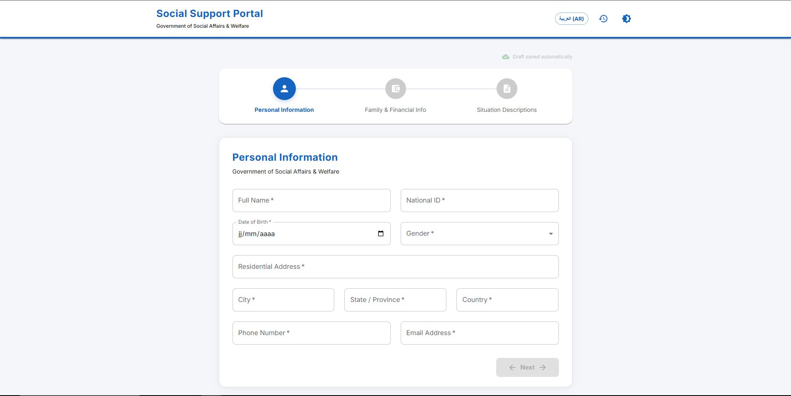
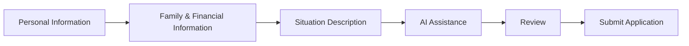
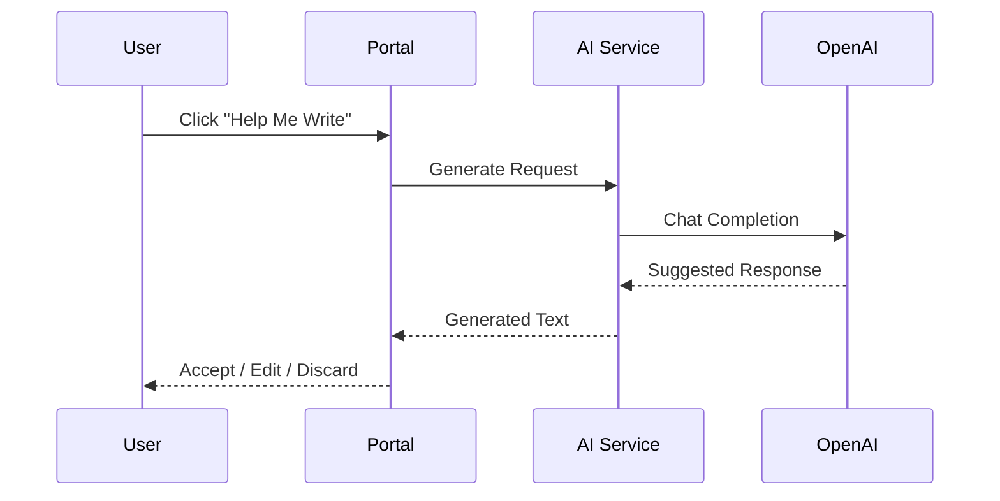
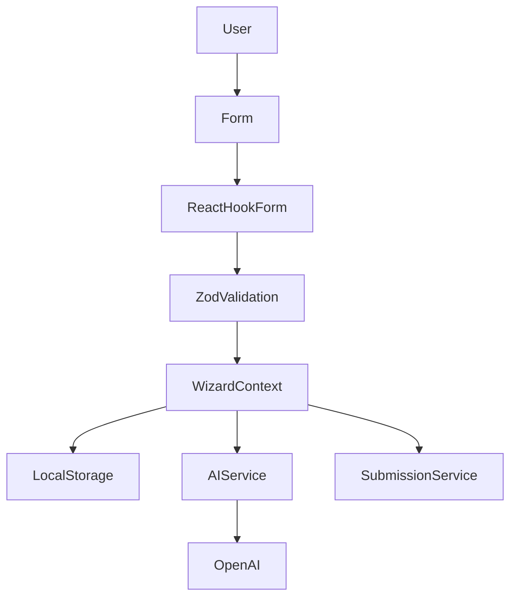

# Social Support Portal Wizard

<p align="center">
  
</p>

<p align="center">
  <strong>AI-Assisted Government Application Portal</strong><br/>
  A multilingual, accessible, and responsive citizen support platform built with React, TypeScript, and Material UI.
</p>

---

## Live Demo

🔗 https://social-support-wizard-x2eh.vercel.app/

## GitHub Repository

🔗 https://github.com/aminehamrouni24/social-support-wizard

---

# Project Overview

This application was developed as part of a Senior Frontend Developer technical assessment.

The objective was to design and build a modern social support application portal that helps citizens complete financial assistance requests through a guided workflow and AI-powered writing assistance.

The application focuses on:

* Excellent user experience
* Accessibility
* Multilingual support
* Responsive design
* Form validation
* State persistence
* AI-assisted content generation

---

# Application Flow



---

# AI Assistance Flow



---

# Architecture Overview



---

# Key Features

## Multi-Step Wizard

The application is divided into four stages:

### Step 1 — Personal Information

Collects:

* Full Name
* National ID
* Date of Birth
* Gender
* Address
* City
* State
* Country
* Phone Number
* Email

### Step 2 — Family & Financial Information

Collects:

* Marital Status
* Dependents
* Employment Status
* Monthly Income
* Housing Status

### Step 3 — Situation Description

Applicants can explain:

* Current Financial Situation
* Employment Circumstances
* Reason for Applying

Each section includes AI-powered writing assistance.

### Step 4 — Review & Submission

Users can review and submit their application.

---

# AI-Assisted Writing

The portal includes an AI assistant designed to help applicants draft clear and professional descriptions of their circumstances.

Features:

* Context-aware text generation
* Editable suggestions
* Accept or discard workflow
* Error handling
* Loading states
* Mock mode fallback

---

# Accessibility

Accessibility was treated as a core requirement.

Implemented features include:

* Semantic HTML
* Keyboard navigation
* ARIA labels
* Screen-reader support
* Accessible validation messages
* Focus management

Target: WCAG AA compliance principles.

---

# Internationalization

The application supports:

* English
* Arabic
* Runtime language switching
* Full RTL layout support

The interface dynamically updates direction and content without page reloads.

---

# Local Persistence

User progress is automatically saved.

Features:

* Draft autosave
* LocalStorage persistence
* Recovery after page refresh
* Unsaved changes protection

---

# Responsive Design

The interface is optimized for:

* Mobile devices
* Tablets
* Desktop environments

The layout adapts automatically across screen sizes.

---

# Screenshots

## Personal Information


## Family & Financial Information


## AI Assistance


## Arabic RTL Experience


---

# Technology Stack

| Category             | Technology        |
| -------------------- | ----------------- |
| Framework            | React 18          |
| Language             | TypeScript        |
| Build Tool           | Vite              |
| UI Library           | Material UI       |
| Forms                | React Hook Form   |
| Validation           | Zod               |
| State Management     | React Context API |
| Internationalization | React-i18next     |
| HTTP Client          | Axios             |
| AI Integration       | OpenAI API        |

---

# Project Structure

```text
src/
├── assets/
├── components/
│   ├── ai/
│   ├── common/
│   └── layout/
├── constants/
├── context/
├── hooks/
├── i18n/
├── pages/
├── services/
├── steps/
├── types/
└── main.tsx
```

---

# Getting Started

## Prerequisites

* Node.js 18+
* npm 9+

## Installation

```bash
git clone https://github.com/aminehamrouni24/social-support-wizard.git

cd social-support-wizard

npm install
```

## Run Development Server

```bash
npm run dev
```

## Build Production Version

```bash
npm run build
```

## Preview Production Build

```bash
npm run preview
```

---

# Environment Variables

Create a `.env` file in the project root.

```env
VITE_OPENAI_API_KEY=your_openai_api_key
```

If no API key is provided, the application automatically falls back to a mock AI mode for evaluation purposes.

---

# Technical Decisions

## Why React Hook Form?

* Minimal re-renders
* Excellent performance
* Strong TypeScript support

## Why Zod?

* Runtime validation
* Type-safe schemas
* Predictable form behavior

## Why Context API?

* Lightweight solution for shared application state
* Simpler than Redux for this scope

## Why Local Storage?

* Prevents accidental data loss
* Improves citizen experience
* Enables draft recovery

## Why Lazy Loading?

* Smaller initial bundle size
* Faster initial page load
* Better scalability

---

# Future Enhancements

Potential production improvements include:

* Authentication and identity verification
* Document uploads
* Backend integration
* Case management workflows
* Government service integrations
* Audit logging
* Analytics and monitoring
* Automated testing pipeline
* CI/CD deployment workflows

---

# Author

**Amine Hamrouni**

Senior Frontend Developer Candidate
