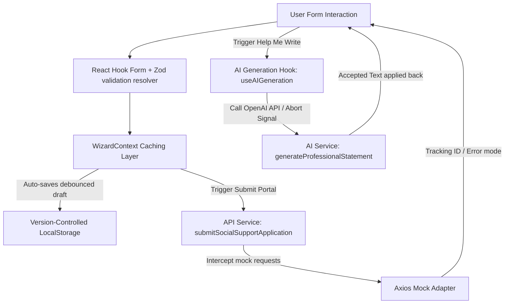

# Production-Grade Social Support Portal Wizard

Welcome to the **Social Support Portal Wizard**, an enterprise-grade, accessible, multi-lingual government assistance portal. Built using modern frontend patterns and following strict CLEAN architecture rules, this portal demonstrates senior frontend engineering practices, type safety, modular services, dynamic state caching, and AI integration.

---

## 🚀 How to Run the Project

### Prerequisites
* **Node.js**: `>= 18.x`
* **npm**: `>= 9.x`

### Installation
1. **Clone the repository and navigate to the project directory:**
   ```bash
   git clone <repository_url>
   cd social-support-wizard
   ```

2. **Install dependencies:**
   ```bash
   npm install
   ```

### Running Locally
To start the local Vite development server with Hot Module Replacement (HMR):
```bash
npm run dev
```

### Production Build & Lint Checks
To compile and build production-grade static assets:
```bash
npm run build
```
To run ESLint verification:
```bash
npm run lint
```

---

## 🔑 How to Set Up the OpenAI API Key

This application features an **AI-Assisted Formulation Tool** ("Help Me Write") that connects to the OpenAI API. It helps applicants generate professional, administrative statements based on their form inputs.

1. Create a `.env` file in the root directory of the project.
2. Add your OpenAI API key using the following environment variable:
   ```env
   # Optional: Add your OpenAI Key. If omitted, the portal will fall back to dynamic mock generation.
   VITE_OPENAI_API_KEY=your_actual_openai_api_key_here
   ```
3. Restart the Vite development server (`npm run dev`) for the environment variables to take effect.

> **Note:** If the API key is omitted or left as the placeholder, the application gracefully falls back to a **mock generation mode** that simulates the API response. This ensures the app remains fully functional for evaluation without an active OpenAI subscription!

---

## 🏗️ Architecture Design & Folder Structure

This project follows strict separation of concerns, segregating business logic, UI presentation, validation, services, and localization.

```
src/
├── assets/         # Static assets and globally loaded media
├── components/     # Reusable presentation and layout components
│   ├── ai/         # AI Assistance modal and AI history side panel
│   ├── common/     # Reusable layout fragments: Stepper, skeleton loader, error boundaries
│   └── layout/     # Master page template structures (WizardLayout, themes)
├── constants/      # Schema definitions, configuration parameters, validation logic
├── context/        # Version-controlled global state provider (autosave cache)
├── hooks/          # Custom hooks: useAIGeneration, useFormAnalytics
├── i18n/           # Dynamic EN/AR react-i18next dictionary configurations
├── pages/          # Router page controller (AppRoutes)
├── steps/          # Code-splitted form step page components (lazy loaded)
├── services/       # AI service and intercepted Mock API client layers
├── types/          # Strict TypeScript contract interfaces
└── main.tsx        # Dynamic system bootstrapper
```

### 🔁 Data & Integration Flow



---

## ⚡ Key Technical Features & Senior Engineering Standards

### 1. Robust State Persistence & Autosave (Zod Coercion)
* **Debounced Autosave**: Draft states are cached in `localStorage` inside the central Context, debounced at `800ms` to protect browser execution.
* **Schema Versioning**: LocalStorage keys are prefixed with version strings (e.g. `social_support_portal_draft_v1`), allowing future schema migrations.
* **Unsaved Changes Notice**: Detects dirty state flags and alerts users with window `beforeunload` alerts when attempting to leave with unsubmitted forms.

### 2. Multi-lingual Runtime & Full RTL Mirroring
* **Dynamic Language Switcher**: Toggles seamlessly between **English (EN)** and **Arabic (AR)** using `react-i18next`.
* **Zero-Reload Mirroring**: Leverages `@emotion/cache` and `stylis-plugin-rtl` to physically mirror the CSS CSSOM, offering a native experience for Arabic users.
* **Multilingual Schemas**: Zod validation schemas are typed to output translation keys as error strings, supporting real-time runtime translation updates.

### 3. WCAG AA Accessibility Standards
* **Semantic HTML**: Structural dividers utilize proper semantic tags.
* **ARIA Integrity**: Solved complex React 18 / Material-UI 5 Popover and Modal accessibility issues (e.g., properly mapping `aria-hidden` and explicitly disabling scroll locks to prevent descendant focus bugs).

### 4. Code Splitting & Performance Optimizations
* **Lazy Loading**: Form steps are split into separate script bundles loaded on-demand via `React.lazy` and `Suspense`.
* **Rendering Guards**: Heavy layouts leverage memoization caches and use stable custom hook callbacks.

### 5. OpenAI AI-Assisted Statement Formulation
* Dedicated AI service wrapping OpenAI `chat/completions` endpoint.
* Responsive guideline parameters allowing custom applicant instructions.
* Supports **cancellation** (via AbortController) and automatic **retry** logic.

---

### Suggested Future Improvements
1. **Testing Suite**: Implement comprehensive unit testing using Vitest and React Testing Library, and End-to-End (E2E) testing with Playwright.
2. **Backend Integration**: Replace the Axios mock adapter with real REST or GraphQL endpoints.
3. **CI/CD Pipelines**: Add GitHub Actions pipelines for automated linting, type-checking, testing, and deployments.
